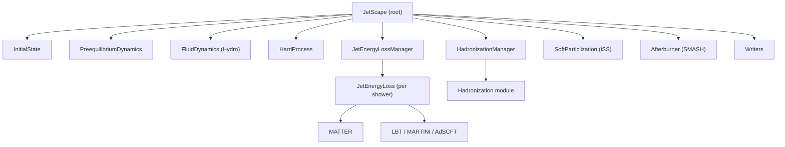

# Architecture & Execution Model

## Why a framework?

A complete simulation of a relativistic nuclear collision spans an enormous
range of scales in space, time, and momentum: the colliding nuclei, the
out-of-equilibrium glue produced in the first fraction of a fm/c, a
near-perfect fluid of quarks and gluons, the hard partons that plough through
it losing energy, and finally thousands of hadrons that re-scatter on their way
to the detector. No single physics model is valid across all of these regimes.

The JETSCAPE/X-SCAPE answer is to make each regime a **swappable module** behind
a common interface, and to let a thin framework orchestrate them. This delivers
three things the heavy-ion community needs:

1. **Apples-to-apples model comparison** — swap MATTER for LBT, or MUSIC for
   CLVisc, changing one line of XML and nothing else.
2. **Reproducibility** — an event is fully specified by its XML plus a seed.
3. **A platform for global/Bayesian analysis** — the same executable can be
   driven across a parameter space to constrain the QGP's transport
   coefficients against data.

See [The JETSCAPE framework, arXiv:1903.07706](https://arxiv.org/abs/1903.07706)
for the original design, and the [References](../references.md) page for the
small-system and beam-energy-scan extensions that motivated X-SCAPE.

## The task graph

Everything that runs is a [`JetScapeTask`](tasks-modules.md). A task owns a
vector of sub-tasks, so the whole simulation is a **tree** rooted at the
top-level `JetScape` object:



The lifecycle is driven by a small set of recursive virtual methods on
`JetScapeTask`. Each has a *self* method (operating on the task itself) and a
*recursion* method (descending into sub-tasks):

| Phase | Self hook | Recursion | When |
|---|---|---|---|
| Initialize | `InitTask()` | `InitTasks()` | once, at startup |
| Execute | `ExecuteTask()` | `ExecuteTasks()` | once per event |
| Write | `WriteTask(w)` | `WriteTasks(w)` | once per event |
| Clear | `ClearTask()` | `ClearTasks()` | end of each event |
| Finish | `FinishTask()` | `FinishTasks()` | once, at shutdown |

A typical module overrides only the *self* hooks; the base class handles the
recursion. The default `Exec()` calls `ExecuteTask()` and then `ExecuteTasks()`,
so a module author rarely needs to think about the tree at all.

## Per-event execution (JETSCAPE mode)

The classic execution model is **strictly sequential per event**. For each
event, `JetScape::Exec()` walks the task tree once, in configuration order:

```
for each event:
    InitPerEvent()      (modules that need per-event setup)
    ExecuteTasks()      Initial state -> Pre-eq -> Hydro -> Hard ->
                        Energy loss -> Hadronization -> Particlization ->
                        Afterburner
    CollectHeaders()    gather per-event header info for the writers
    WriteTasks()        emit the event record
    ClearTasks()        reset module state for the next event
```

Execution is serial by default — per-module multithreading exists in the code
(`SetMultiThread`) but is disabled. The natural parallelism for production is at
the **event level**: run many independent events as separate processes/jobs.

## Time-stepped, concurrent execution (X-SCAPE mode)

The defining new capability of X-SCAPE is that modules can be advanced
**concurrently in time steps** instead of one-stage-after-another. This is
essential when the stages are not cleanly separable in time — for example in
small systems, where the hard scattering, the developing medium, and the
energy loss overlap and must conserve four-momentum exactly.

To support this, `JetScapeModuleBase` adds a second set of lifecycle hooks that
operate **per time step** rather than per event:

| Per-time-step hook | Role |
|---|---|
| `CalculateTime()` / `CalculateTimeTask()` | compute what this module would do at the current tick (no state change yet) |
| `ExecTime()` / `ExecTimeTask()` | commit the step's evolution |
| `IsTimeStepped()` / `SetTimeStepped()` | mark whether a module participates in the time loop |
| `CheckExec()` / `CheckExecs()` | verify a module and its sub-modules are *consistently* per-event or per-time-step |

A [`MainClock`](clock.md) drives the loop. At each tick every time-stepped
module first **calculates** its prospective update, the
[Bulk Dynamics Manager](bulk-dynamics.md) reconciles the bulk medium, and then
every module **executes** the step. Because `CalculateTime` and `ExecTime` are
split, the clock can be rewound: a module computes a step, the framework
decides whether to accept it, and only then is the state advanced. This is what
lets the main clock "go backwards and forwards" to treat initial-state and
final-state evolution on the same footing.

!!! note "Backwards compatibility"
    A module that does not override the per-time-step hooks simply runs in the
    classic per-event mode. New and old modules can coexist in one run; a
    module can also be *hybrid*, opting into the clock for part of its work.
    `CheckExec()` exists precisely to catch inconsistent mixtures early.

## What flows between stages

Two kinds of payload move through the graph:

- **The parton/hadron record** — partons from the hard process become a
  `PartonShower` (a graph of `shared_ptr<Parton>`), which energy-loss modules
  modify and hadronization turns into hadrons. See
  [the event record](tasks-modules.md#the-event-record).
- **The bulk medium** — the hydro evolution is stored as a 4-D
  `EvolutionHistory` of `FluidCellInfo` and read back by every downstream module
  through the [signal layer](signals.md).

The next pages document each piece in turn.
