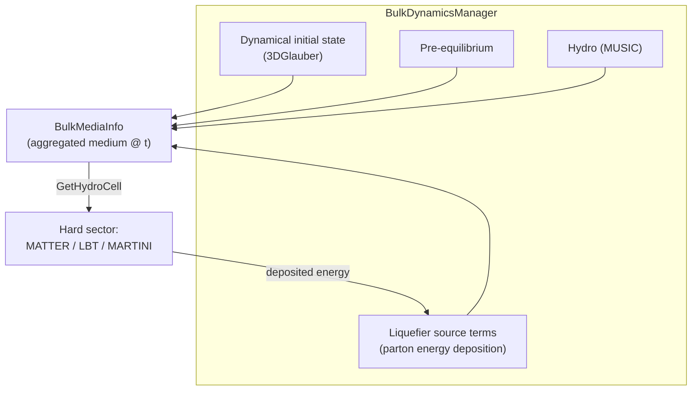

# Bulk Dynamics Manager

## Motivation

In a large heavy-ion collision a single hydrodynamic module is a perfectly good
description of the bulk. In **small systems and at lower energies** that is no
longer true: the medium is built up dynamically while hard partons are already
propagating through it and depositing energy back into it. The bulk is then the
sum of several contributions — a dynamical initial state still being laid down,
a pre-equilibrium stage, a hydro cell, and the *recoil/source* energy fed back
by quenched partons (the [liquefier](../physics/liquefier.md)) — all coexisting
at the same time step.

The **Bulk Dynamics Manager** (`src/framework/BulkDynamicsManager.{h,cc}`) is
the X-SCAPE component that lets these bulk generators **run concurrently and be
queried as one medium**. It is the piece that makes a soft–hard framework with
exact four-momentum conservation possible (see
[arXiv:2407.17443](https://arxiv.org/abs/2407.17443) and
[arXiv:2308.02650](https://arxiv.org/abs/2308.02650)).

## What it does

`BulkDynamicsManager` is itself a `JetScapeModuleBase`, so it sits in the task
tree and participates in the [clock](clock.md). Its responsibilities:

1. **Hold the active bulk modules** as sub-tasks and drive their per-time-step
   evolution (`CalculateTime()` then `ExecTime()`).
2. **Aggregate** their individual cell contributions into a single
   `BulkMediaInfo` for the current time and position.
3. **Serve medium queries** to the hard sector through the same
   `GetHydroCell`-style interface the energy-loss modules already use — so a
   quenching module does not need to know whether it is reading a finished
   `EvolutionHistory` or a live, multi-source bulk state.
4. **Track hadron lists** exchanged across time steps.

## Supporting types

| Type | Role |
|---|---|
| `BulkMediaBase` (`BulkMediaBase.{h,cc}`) | abstract interface a bulk contributor exposes to the manager |
| `BulkMediaInfo` (`BulkMediaInfo.{h,cc}`) | the aggregated medium state (energy density, flow, temperature, …) at one time/point, returned to consumers |
| `LiquefierBase` (`LiquefierBase.{h,cc}`) | converts the four-momentum lost by hard partons into hydrodynamic source terms fed back into the bulk — closes the energy-conservation loop |
| `QueryHistory` (`QueryHistory.{h,cc}`) | a singleton that lets any module pull historical bulk/medium information by name without a direct pointer |

## The energy-conservation loop

The defining feature of the X-SCAPE bulk treatment is that energy lost by a jet
does not vanish — it is **returned to the medium**. As a parton loses
four-momentum in an energy-loss module, the [liquefier](../physics/liquefier.md)
deposits a corresponding source term `J^ν(x)` into the hydrodynamic
energy-momentum conservation equation,

\[
\partial_\mu T^{\mu\nu}(x) = J^\nu(x),
\]

which the Bulk Dynamics Manager hands to the active hydro module on the next
time step. Over the event this conserves total four-momentum exactly between the
hard and soft sectors — the central requirement for consistently combining jets
and bulk in small systems.

See the [Liquefier & Source Terms](../physics/liquefier.md) page for the
causal-diffusion smearing kernel used to localize the deposited energy.
