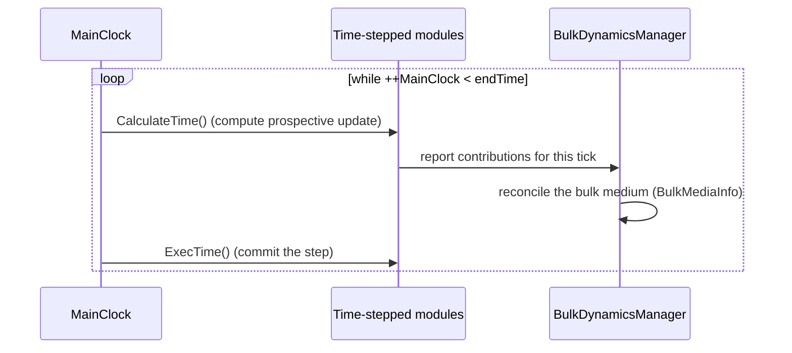

# The Dynamical Clock

## Motivation

In the classic JETSCAPE picture the stages are time-ordered and disjoint: the
initial state happens, *then* hydro evolves, *then* jets quench in the finished
medium. That ordering breaks down in exactly the regimes X-SCAPE targets:

- In **small systems** the hard scattering, the build-up of the bulk, and the
  energy loss all happen within the same first fm/c and overlap in time. Treating
  them sequentially double-counts or mis-conserves energy.
- At **beam-energy-scan** energies the colliding nuclei have a finite crossing
  time; the initial state is *deposited dynamically* over a range of τ rather
  than instantaneously.
- **Initial-** and **final-state** radiation are the same physics (a virtuality-
  ordered shower) run in opposite time directions.

The X-SCAPE solution is a **main simulation clock that can advance and rewind**,
with every participating module evolving one time step at a time. This puts
initial-state and final-state evolution on a common footing and lets multiple
generators run concurrently.

## Clock classes

All clocks derive from `ClockBase` (`src/framework/ClockBase.{h,cc}`), which
carries an `id` and a **time-reference-frame id** (`time_id`) — because
different modules naturally work in different time variables (lab time `t` vs.
Bjorken proper time τ).

| Class | Role |
|---|---|
| `ClockBase` | abstract base: id + reference-frame id + `Info()` |
| `MainClock` | the global driver. Holds `startTime`, `endTime`, `deltaT`, `currentTime`; `operator++`/`Next()` advance a tick and report whether the run is still within `endTime`. Defaults: Δt = 0.1, t₀ = 0, t_end = 20 + Δt (fm/c). |
| `ModuleClock` | a per-module clock that can run in its own reference frame and convert to/from the main clock's time. |
| `MilneClock` | a clock that works in Milne/Bjorken coordinates (proper time τ, space-time rapidity η) for boost-invariant hydro modules. |
| `TimeModule` | mix-in (inherited by `JetScapeModuleBase`) that gives every module access to the current clock and its time. |

## How a time step runs

A time-stepped run replaces the single per-event `ExecuteTasks()` sweep with a
loop over clock ticks. Each tick is two-phase:

Splitting **calculate** from **execute** is what makes the clock reversible: a
module proposes its update during `CalculateTime()` without mutating its state,
the framework (via the manager) decides whether to accept or revisit the step,
and only `ExecTime()` actually advances. A module declares participation with
`SetTimeStepped(true)` / `IsTimeStepped()`.

## Consistency checking

Mixing per-event and per-time-step modules in one run is legal but must be
*consistent* within a sub-tree. `JetScapeModuleBase::CheckExec()` (and its
recursive `CheckExecs()`) verifies this at startup and flags a module that is
neither cleanly per-event nor per-time-step. Modules that are intrinsically
neither — e.g. the jet-energy-loss modules, which are driven by the shower
rather than the wall clock — override `CheckExec()` as a no-op.

## Using the clock

The clock is configured in XML (start/end time and Δt) and wired up by the
top-level `JetScape` object. End-to-end examples that exercise the time-stepped
path live in `examples/custom_examples/`:

- `MUSICMainClockTest.cc` + `config/jetscape_user_MUSICMainClockTest.xml` — hydro
  driven by the main clock.
- `PythiaBDMTest.cc` — PYTHIA hard process coordinated through the Bulk Dynamics
  Manager.

!!! note
    Time-stepped execution is **not yet exposed through the standard
    `runJetscape` XML path**; it is driven by the dedicated example executables.
    Backwards-compatible per-event runs ignore the clock entirely.
