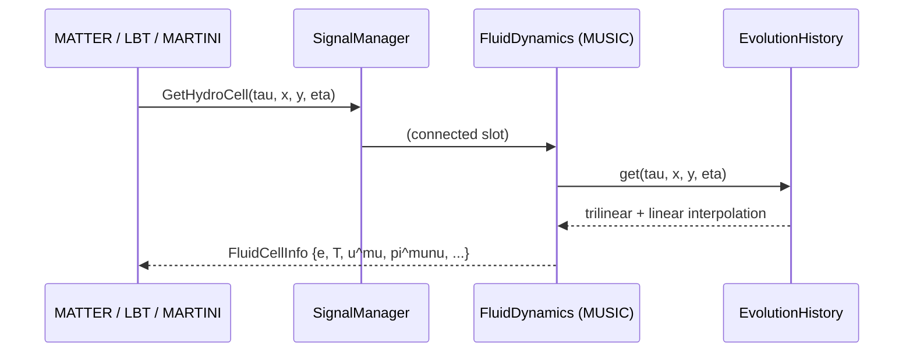

# Signals & Data Flow

Modules in X-SCAPE are deliberately decoupled — MATTER does not hold a pointer
to MUSIC. Instead they communicate through a **publish/subscribe layer** built
on the header-only [`sigslot`](https://github.com/JETSCAPE/JETSCAPE/blob/main/src/framework/sigslot.h)
library. One module exposes a *signal*; another connects a *slot* to it; calling
the signal invokes every connected slot. This is how a jet-energy-loss module
asks "what is the medium doing at this point?" without knowing which hydro
module (or none) is answering.

## The signal manager

`JetScapeSignalManager` (`src/framework/JetScapeSignalManager.{h,cc}`) is a
**singleton** that owns the wiring. During initialization it walks the task tree
and, for every consumer/producer pair, calls the appropriate `Connect…`
method. It also keeps maps of the established connections for debugging
(`PrintGetHydroCellSignalMap()`, counters such as
`GetNumberOfGetHydroCellSignals()`) and tears them down between events.

## The principal signals

| Signal (Connect method) | Producer → Consumer | Payload |
|---|---|---|
| `ConnectGetHardPartonListSignal` | `HardProcess` → `JetEnergyLossManager`, `IsrManager` | the list of hard partons that seed the showers |
| `ConnectSentInPartonsSignal` | `JetEnergyLoss` → energy-loss module | hands the current parton list to a module for one step of energy loss |
| `ConnectJetSignal` / `ConnectEdensitySignal` | framework → `JetEnergyLoss` | request medium / energy-density at a point |
| `ConnectGetHydroCellSignal` | `FluidDynamics` → `JetEnergyLoss`, `Hadronization`, `LiquefierBase` | **the hot path:** returns a `FluidCellInfo` (ε, T, flow `u^μ`, shear `π^{μν}`, …) at a requested (τ, x, y, η) |
| `ConnectGetHydroTau0Signal` | `FluidDynamics` → `JetEnergyLoss` | the hydro start time τ₀ |
| `ConnectGetFinalPartonListSignal` | `JetEnergyLossManager` → `HadronizationManager` | the post-energy-loss partons to be hadronized |
| `ConnectTransformPartonsSignal` | `Hadronization` ↔ module | turn partons into hadrons |
| `ConnectGetHydroHyperSurfaceSignal` | `FluidDynamics` → `Hadronization`, `SoftParticlization` | the Cooper–Frye freeze-out hypersurface |
| `ConnectClearHydroHyperSurfaceSignal` | framework → `FluidDynamics` | free the surface between events |
| `ConnectGetFinalHadronListSignal` | framework → `HadronPrinter` | the final hadron list for output |

## The medium-query path

The single most important — and most frequently called — signal is
`GetHydroCellSignal`. Every energy-loss module queries the medium **per parton,
per micro-step** of its trajectory:

`EvolutionHistory::get()` (`FluidEvolutionHistory.{h,cc}`) does an
**O(1)-indexed** lookup on a uniform (τ, x, y, η) grid — no search — followed by
trilinear interpolation in space and linear interpolation between the two
bracketing τ-slices. The cell carries the local energy density, temperature,
pressure, QGP fraction, chemical potentials (μ_B, μ_C, μ_S), the flow velocity,
and the full shear-stress tensor `π^{μν}` and bulk pressure Π — everything a
quenching model needs to evaluate transport coefficients in the local rest
frame.

!!! info "Performance note"
    Because this signal fires O(partons × micro-steps) times per event, its cost
    dominates the medium-interaction budget. The framework's `FluidCellInfo`
    is returned by value; production tuning typically caches the τ-bracket
    across consecutive micro-steps. See the engineering notes in
    `XSCAPE-CodeAnalysis.md` (§5.2) for details.

## Bulk information in time-stepped mode

In X-SCAPE's concurrent mode the medium is not a finished 4-D history but a
**snapshot that grows tick by tick**. The
[Bulk Dynamics Manager](bulk-dynamics.md) aggregates the contributions of all
active bulk generators into a `BulkMediaInfo` for the current time, and the same
`GetHydroCell`-style queries are answered from that live state instead of from a
completed `EvolutionHistory`.
