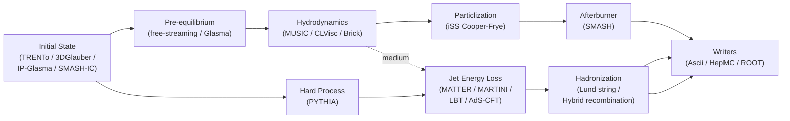

# X-SCAPE

**X-ion collisions with a Statistically and Computationally Advanced Program
Envelope**

X-SCAPE is the second-generation framework of the
[JETSCAPE Collaboration](http://jetscape.org). It is a modular,
task-based event generator for the full space–time evolution of
relativistic nuclear collisions — from the initial state, through
pre-equilibrium and viscous hydrodynamics, hard scattering and multistage jet
energy loss, hadronization, and a hadronic afterburner.

X-SCAPE extends the original [JETSCAPE](https://arxiv.org/abs/1903.07706)
framework to:

- **small collision systems** (p–p and p–A), where soft and hard sectors must
  be treated coherently with exact energy–momentum conservation;
- **lower-energy heavy-ion collisions** relevant to the RHIC Beam Energy Scan,
  where net-baryon transport and a 3-D dynamical initial state matter;
- **electron–ion collisions** (DIS and photoproduction), via a dedicated
  electron–proton gun;
- **concurrent, time-stepped evolution** of multiple bulk and hard modules,
  enabled by a new main simulation clock that can advance *and rewind* in time,
  coordinated through a **Bulk Dynamics Manager**.

X-SCAPE is **fully backwards compatible** with JETSCAPE: existing per-event
modules and XML configurations run unchanged, while new modules may opt into the
time-stepped, concurrent mode.

---

## How this documentation is organized

- :material-cog-outline: **[Framework](framework/index.md)**

    The execution model — the task graph, module base classes and factory, the
    sigslot signal layer, the dynamical clock, the Bulk Dynamics Manager, XML
    configuration, and the writer/reader I/O.

- :material-atom: **[Physics Modules](physics/index.md)**

    The multistage physics picture and a chapter per stage: initial state,
    initial-state radiation, pre-equilibrium, hydrodynamics, hard process,
    jet energy loss, hadronization, particlization, the hadronic afterburner,
    and the liquefier source terms — each with its physics motivation and
    primary references.

- :material-rocket-launch-outline: **[User Guide](guides/index.md)**

    Installation, building with optional packages, running the executables,
    and a tour of the bundled examples.

- :material-code-tags: **[API Reference](api-overview.md)**

    The C++ reference for every framework and module class, generated from the
    source by Doxygen and rendered natively in this site.

---

## The simulation pipeline at a glance

A canonical heavy-ion event flows through the following stages. Each box is one
or more interchangeable modules selected in the XML configuration:

In **X-SCAPE mode** the bulk stages (initial state → pre-equilibrium → hydro)
and the hard stages can be advanced *concurrently in time steps*, exchanging
information through the [Bulk Dynamics Manager](framework/bulk-dynamics.md) and a
shared clock, rather than running strictly one-after-another per event.

---

## Citing X-SCAPE

If you use this package for scientific work, please cite the JETSCAPE framework
paper:

> The JETSCAPE Collaboration, *The JETSCAPE framework*,
> [arXiv:1903.07706](https://arxiv.org/abs/1903.07706).

For the small-system / soft–hard extensions, also cite the relevant X-SCAPE
papers listed on the [References](references.md) page.

!!! note "Versions"
    This documentation tracks **X-SCAPE 2.1** (JETSCAPE compatibility version
    4.0.2). Version identifiers live in `src/framework/Version.h`.
