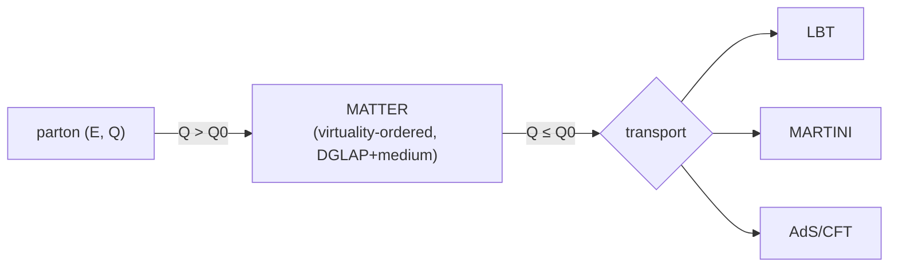

# Jet Energy Loss

## Physics motivation

A hard parton produced in the initial scattering does not escape the fireball
untouched. As it traverses the QGP it **loses energy** — by medium-induced
gluon radiation and by elastic scattering off medium constituents — and is
**deflected**. The resulting suppression and modification of high-$p_T$ hadrons
and jets ("**jet quenching**") is one of the defining signatures of QGP
formation, and its detailed pattern encodes the medium's transport coefficient
$\hat q$ (the transverse-momentum broadening per unit path length) and its
temperature dependence.

Crucially, **jet quenching is multi-scale**. Right after the hard vertex the
parton is highly **virtual** ($Q \gg$ medium scales) and loses energy mainly
through a rapid, vacuum-like radiative cascade that the medium perturbs. As its
virtuality degrades it becomes a nearly on-shell parton whose energy loss is
dominated by **scattering** off the thermal medium, well described by transport
(Boltzmann) approaches. No single model is accurate across both regimes.

X-SCAPE's answer is the **multistage shower**: assign each parton, at each step,
to the energy-loss model appropriate for its current virtuality $Q$ and energy
$E$, with a switching scale $Q_0$ (typically 1–2 GeV).



*References:* the multistage approach —
[arXiv:1705.00050](https://arxiv.org/abs/1705.00050) (Cao & Majumder),
[arXiv:2002.07124](https://arxiv.org/abs/2002.07124),
[arXiv:2009.02410](https://arxiv.org/abs/2009.02410) (JETSCAPE constraints on
jet quenching); the framework — [arXiv:1903.07706](https://arxiv.org/abs/1903.07706).

## The energy-loss machinery

| Component | Class / file | Role |
|---|---|---|
| Manager | `JetEnergyLossManager` (`src/framework/`) | owns one `JetEnergyLoss` per hard parton; receives the hard-parton list |
| Per-shower driver | `JetEnergyLoss` (`src/framework/`) | advances a parton's shower in micro-steps; holds the active modules and the switching logic |
| Module base (CRTP) | `JetEnergyLossModule<Derived>` (`src/framework/JetEnergyLossModule.h`) | base for each model; defines `DoEnergyLoss(deltaT, time, Q2, pIn, pOut)` |
| Shower generator | `PartonShowerGenerator` / `…Default` | builds the `PartonShower` graph from the splittings |
| Mutual exclusion | `*Mutex` classes | declare which modules may run together |

A module's core method is:

```cpp
virtual void DoEnergyLoss(double deltaT, double time, double Q2,
                          vector<Parton>& pIn, vector<Parton>& pOut);
```

It receives the incoming partons `pIn` and the local medium properties (queried
via the [`GetHydroCell` signal](../framework/signals.md) at the parton's
position) and returns the post-step partons / radiated daughters in `pOut`. The
manager calls it repeatedly over the parton's trajectory; the `*Mutex` classes
(e.g. `LBTMutex`, `MartiniMutex`, `AdSCFTMutex`) encode the **virtuality
hand-off** — they decide, per parton per step, which module is allowed to act.

## Modules

### MATTER — high-virtuality medium-modified shower

**XML:** `<Eloss><Matter>…</Matter></Eloss>` · **class:** `Matter`
(`src/jet/Matter.{h,cc}`)

**M**odular **A**ll **T**win **T**ransport **E**nergy-loss **R**adiation handles
the **high-virtuality** stage. It evolves a **virtuality-ordered** parton shower
— DGLAP vacuum radiation supplemented by **medium-induced** radiation governed by
$\hat q$ — and tracks each parton's **formation time**, the key quantity that
separates coherent (vacuum-like) from incoherent (medium-resolved) emission. It
also includes a recoil/elastic component. MATTER is the entry point for every
hard parton; partons drop out of MATTER when their virtuality falls below $Q_0$
and are handed to a transport module.

Key parameters: `in_vac` (vacuum vs. medium), `Q0` (switching virtuality),
`vir_factor`, `qhat0`/`alphas` ($\hat q$ normalization). Its $\hat q$
parametrization follows the fit in
[arXiv:1503.03313](https://arxiv.org/abs/1503.03313).

*References:* Majumder, [arXiv:1301.5323](https://arxiv.org/abs/1301.5323);
Cao & Majumder, [arXiv:1712.10055](https://arxiv.org/abs/1712.10055).

### LBT — Linear Boltzmann Transport

**XML:** `<Eloss><Lbt>…` · **class:** `LBT`
(`src/jet/LBT.{h,cc}`, requires LBT scattering tables in
`external_packages/LBT-tables`)

LBT handles the **low-virtuality**, scattering-dominated stage by solving the
**linear Boltzmann equation** for the jet parton (and its thermal recoils) in the
medium. It includes both elastic ($2\to2$) scatterings with leading-order pQCD
matrix elements and inelastic ($2\to3$) medium-induced radiation, and it
explicitly **tracks recoil partons and the "negative" (back-reaction) partons**
that represent the energy removed from the medium — important for jet-shape and
medium-response observables.

*Reference:* He, Luo, Wang, Zhu,
[arXiv:1503.03313](https://arxiv.org/abs/1503.03313); Cao, Luo, Qin, Wang.

### MARTINI — rate-based radiative + elastic transport

**XML:** `<Eloss><Martini>…` · **class:** `Martini`
(`src/jet/Martini.{h,cc}`)

MARTINI ("**M**odular **A**lgorithm for **R**elativistic **T**reatment of heavy
**ION I**nteractions") evolves the low-virtuality parton through **rate-based**
transitions: medium-induced radiation rates computed in the AMY (Arnold–Moore–Yaffe)
formalism, tabulated as functions of parton and gluon momenta, plus elastic
collisions. At each step it samples the precomputed rate tables (bilinear
interpolation) to decide radiation/scattering. It is the canonical
**weakly-coupled, thermal-field-theory** energy-loss model.

*Reference:* Schenke, Gale, Jeon,
[arXiv:0909.2037](https://arxiv.org/abs/0909.2037).

### AdS/CFT — strongly-coupled holographic energy loss

**XML:** `<Eloss><AdSCFT>…` · **class:** `AdSCFT`
(`src/jet/AdSCFT.{h,cc}`)

In the opposite, **strong-coupling** limit, energy loss is computed from the
gauge/gravity (AdS/CFT) correspondence rather than perturbative QCD. The module
implements a holographic light-quark/gluon energy-loss prescription in which the
parton's energy degrades according to a falling-string picture, with a
characteristic dependence on path length and temperature distinct from the
perturbative models. It offers a qualitatively different benchmark for the
low-virtuality stage.

*References:* holographic jet energy loss — Chesler & Rajagopal; Casalderrey-Solana
et al.; as implemented for JETSCAPE (see the [References](../references.md) page).

### Validation / utility modules

| Module | XML / class | Role |
|---|---|---|
| Eloss validation | `ElossValidation` | analytic energy-loss test harness |
| Dummy split | `DummySplit` | trivial splitting for framework tests |
| Parton printer | `PartonPrinter` | dump partons at chosen points |
| Hadron printer | `HadronPrinter` | dump hadrons |

## Choosing energy-loss modules

The recommended setup is **multistage**: list **MATTER** plus one transport
model inside `<Eloss>`. MATTER takes the high-virtuality phase; the transport
model takes over below $Q_0$.

| Physics question | Configuration |
|---|---|
| default jet quenching | `Matter` + `Lbt` (or `Matter` + `Martini`) |
| weakly-coupled / AMY rates | `Matter` + `Martini` |
| medium response, recoils | `Matter` + `Lbt` |
| strong-coupling benchmark | `Matter` + `AdSCFT` |
| pure vacuum shower (no medium) | `Matter` with `in_vac = 1` |

!!! note "Energy goes back into the medium"
    The four-momentum a parton loses is not discarded — through the
    [liquefier](liquefier.md) it is deposited as a source term in the
    hydrodynamic evolution, conserving total four-momentum between the jet and
    the bulk. This coupling is central to X-SCAPE's small-system treatment.
