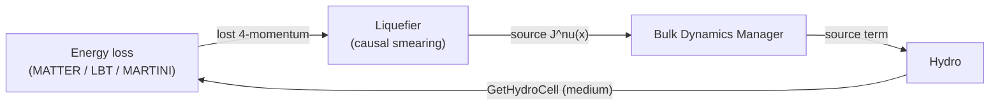

# Liquefier & Source Terms

## Physics motivation

When a jet parton loses energy in the medium, that energy does not disappear — it
is **transferred to the surrounding fluid**, where it excites a hydrodynamic
response (a "Mach cone" / wake) that ultimately shows up as soft hadrons
correlated with the jet. For a consistent simulation — and absolutely
essential for **small systems**, where the jet's energy is a non-negligible
fraction of the total — the energy lost by the hard sector must be **fed back
into the bulk** so that total four-momentum is conserved.

The **liquefier** is the component that performs this conversion. It takes the
four-momentum deposited by quenched partons and turns it into **hydrodynamic
source terms** $J^\nu(x)$ that enter the energy-momentum conservation equation
of the [hydro](hydro.md) stage:

\[
\partial_\mu T^{\mu\nu}(x) \;=\; J^\nu(x).
\]

Because a parton deposits energy at a point but a fluid responds over a finite
region, the source must be **smeared** in space (and causally in time). The
liquefier supplies the smearing kernel, and the
[Bulk Dynamics Manager](../framework/bulk-dynamics.md) hands the resulting
source to the active hydro module on the next [time step](../framework/clock.md).

`LiquefierBase` (`src/framework/LiquefierBase.{h,cc}`) is the base class; it
connects to the medium via the `GetHydroCell` signal and exposes the
`add_hydro_sources(...)` interface that energy-loss modules call when they shed
four-momentum.

## Modules

### Causal liquefier

**class:** `CausalLiquefier` (`src/liquefier/CausalLiquefier.{h,cc}`)

Smears each deposited four-momentum with a **causal** kernel — one that respects
relativistic causality by spreading the source over a space-time region bounded
by the light cone, with a diffusion-like profile in the transverse and
longitudinal directions. This avoids the acausal, instantaneous deposition that
a naive Gaussian smearing would imply, and produces a physically sensible
hydrodynamic wake.

### Hadronic liquefier

**class:** `HadronicLiquefier` (`src/liquefier/HadronicLiquefier.{h,cc}`)

The analogous source-term construction applied at the **hadronic** level, for the
energy/momentum exchanged with a hadronic medium (relevant in the late stage and
at lower energies).

## Related: hadronic energy-momentum tensor

**class:** `HadronicEMT` (`src/hadronicEMT/HadronicEMT.{h,cc}`)

A companion component that builds a coarse-grained **energy-momentum tensor
$T^{\mu\nu}$ from a list of hadrons**, by smearing each hadron's four-momentum
onto a grid (a particle-to-grid deposition). This is the inverse direction to
particlization — it lets a hadronic configuration be re-cast as a continuum
$T^{\mu\nu}$, e.g. to decide which regions should be "fluidized" (treated as
fluid) versus left as particles in a concurrent fluid+particle (hybrid) evolution.

## Why this closes the loop

Together these components implement the **two-way coupling** between the hard and
soft sectors that distinguishes X-SCAPE from a one-way pipeline:

The jet reads the medium; the medium receives the jet's lost energy; four-momentum
is conserved across the whole event. See the
[Bulk Dynamics Manager](../framework/bulk-dynamics.md) and the X-SCAPE soft–hard
framework papers ([arXiv:2308.02650](https://arxiv.org/abs/2308.02650),
[arXiv:2407.17443](https://arxiv.org/abs/2407.17443)).
