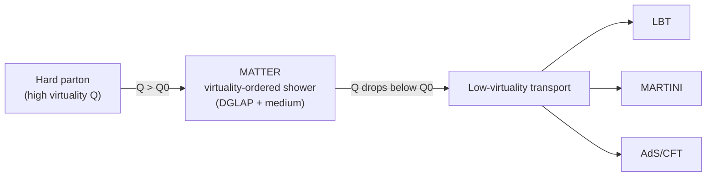

# The Multistage Picture

## The problem

When two heavy nuclei collide at ultra-relativistic energy they create, for a
fleeting ~10 fm/c, the hottest and densest matter accessible in the laboratory:
a **quark–gluon plasma** (QGP), a deconfined fluid of quarks and gluons. The
collision evolves through qualitatively distinct regimes:

1. **Initial state.** Two Lorentz-contracted nuclei overlap. Their partons
   deposit energy and (at lower energy) net baryon number into the transverse
   plane. The geometry is lumpy and fluctuates event to event.
2. **Pre-equilibrium.** For the first few tenths of a fm/c the deposited matter
   is far from equilibrium — strong color fields ("glasma") and/or
   free-streaming partons that have not yet thermalized.
3. **Hydrodynamics.** Within ~1 fm/c the system is well described as a nearly
   ideal relativistic fluid with very small shear viscosity over entropy
   density, η/s. It expands and cools as a QGP.
4. **Particlization / hadronization of the bulk.** As the fluid cools below the
   pseudo-critical temperature (T_c ≈ 155 MeV) it converts to hadrons across a
   freeze-out hypersurface (Cooper–Frye).
5. **Hadronic afterburner.** The hadrons continue to scatter and decay until the
   gas is too dilute to interact — kinetic freeze-out.

Superimposed on this soft bulk are **hard probes**: partons from the rare,
early, high-momentum-transfer scatterings. They are produced before the medium
exists, then traverse it, losing energy and being deflected — **jet
quenching**. The modification of these jets is a tomographic probe of the QGP.

## Why "multistage"?

Jet quenching itself is a multi-scale problem. A highly **virtual** parton just
after the hard scattering radiates copiously and behaves like a vacuum-like
shower mildly modified by the medium. As it loses virtuality it transitions to a
nearly on-shell parton whose energy loss is dominated by **scattering** off the
medium constituents. No single energy-loss model is valid across both regimes.

The JETSCAPE/X-SCAPE insight ([arXiv:1903.07706](https://arxiv.org/abs/1903.07706),
[arXiv:1705.00050](https://arxiv.org/abs/1705.00050)) is to **assign each parton,
at each step, to the model appropriate for its current virtuality and energy**:

The switching scale `Q0` (typically ~1–2 GeV) is a parameter; partons above it
are handled by **MATTER**, below it by a transport model
(**LBT / MARTINI / AdS/CFT**). The same machinery, run in the opposite time
direction, describes **initial-state radiation** ([iMATTER](isr.md)).

## How X-SCAPE maps the physics onto modules

Each regime above is one (swappable) module stage:

| Physics regime | Module stage | Page |
|---|---|---|
| Lumpy initial geometry / net baryon | Initial state | [Initial State](initial-state.md) |
| Space-like shower of incoming partons | ISR (iMATTER) | [ISR](isr.md) |
| Out-of-equilibrium early dynamics | Pre-equilibrium | [Pre-equilibrium](pre-equilibrium.md) |
| QGP fluid | Hydrodynamics | [Hydrodynamics](hydro.md) |
| Rare hard scattering | Hard process | [Hard Process](hard-process.md) |
| Jet quenching (virtuality- then scattering-dominated) | Jet energy loss | [Jet Energy Loss](energy-loss.md) |
| Partons → hadrons | Hadronization | [Hadronization](hadronization.md) |
| Fluid → hadrons (Cooper–Frye) | Particlization | [Particlization](particlization.md) |
| Hadronic rescattering | Afterburner | [Afterburner](afterburner.md) |
| Jet energy returned to the fluid | Liquefier source terms | [Liquefier](liquefier.md) |

## What X-SCAPE adds beyond JETSCAPE

The original JETSCAPE treats these stages as a one-way, per-event sequence —
ideal for large collision systems where the bulk and the jets factorize cleanly.
X-SCAPE removes that assumption to reach:

- **small systems (p–p, p–A)** — soft and hard sectors are evolved
  **concurrently with exact four-momentum conservation**, coordinated by the
  [Bulk Dynamics Manager](../framework/bulk-dynamics.md) and a
  [reversible clock](../framework/clock.md)
  ([arXiv:2308.02650](https://arxiv.org/abs/2308.02650),
  [arXiv:2407.17443](https://arxiv.org/abs/2407.17443));
- **beam-energy-scan energies** — a 3-D dynamical initial state that deposits
  energy *and net baryon number* over a finite formation time
  ([3DGlauber](initial-state.md), [arXiv:1710.00881](https://arxiv.org/abs/1710.00881));
- **electron–ion collisions** — DIS and photoproduction through a dedicated
  electron–proton gun.

The following pages document each stage's modules in detail.
